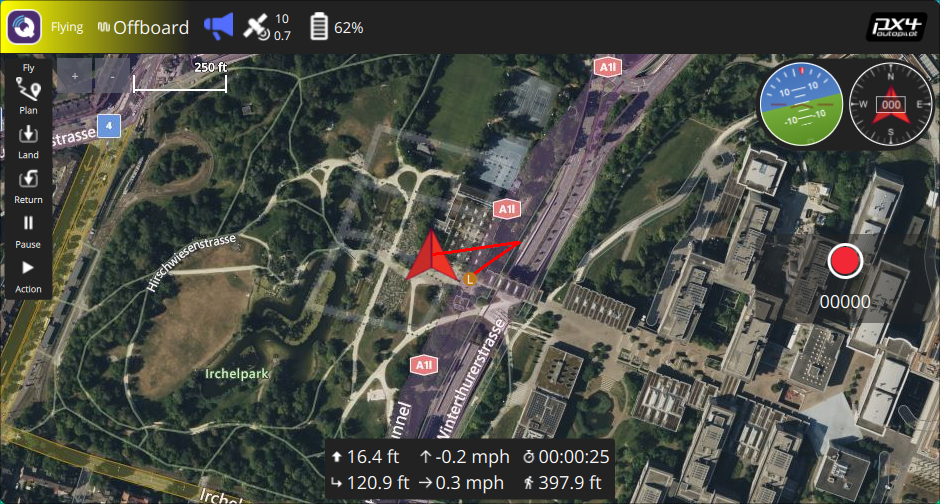
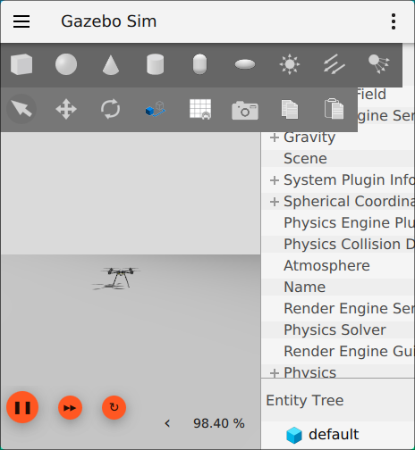
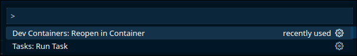
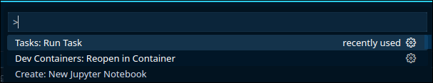
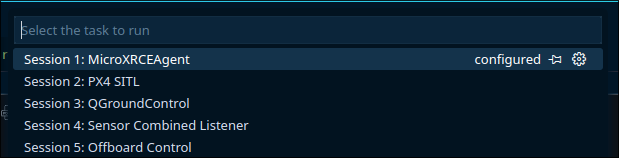

# Waypoint Tracking of Quadcopter in PX4-ROS

This repository provides a streamlined platform to perform waypoint tracking in quadcopter in ROS2, Gazebo and PX4.

### Software Stack

* ROS2 Humble
* Gazebo Harmonic
* PX4
* QGroundControl
* OffboardControl

### Trajectory of Quadrotor Navigation





## **Installation Guide**

### **1. Clone the Repository**

First, clone the project using Git:

bash

```
git clone https://github.com/Srindot/assignment2_Introduction_To_UAV_Design.git
```

### **2. Setup Docker**

Ensure Docker is installed and configured on your device.

### **3. Open the Project in VS Code**

* Launch  **Visual Studio Code (VS Code)** .
* Open the cloned project folder.

### **4. Build the Container**

* Press `Ctrl + Shift + P` to open the  **Command Palette** .

  
* Search for **"Dev Conatiners: Reopen in Container"** and select it to start building the container.

### **5. Run Tasks Inside the Container**

* Once inside the container, press ` Ctrl + Shift + P`  again.

  t
* Search for  **"Run Tasks"** , then select and execute the  **following tasks** :

#### **Available Tasks**

* Below are the tasks avaliable

  

1. MicroXRCEAgent : Connection to ROS2 and PX4
2. PX4 SITL  : To start up PX4 with gazebo gui
3. QGroundControl : To launch QGroundControl
4. Sensor Combined Listener : To echo gyro readings and acceleration in all three axis
5. Offboard Control : To arm the vehicle and publish waypoint for quadcopter to track

or these commands can be run on terminal

1. To launch **MicroXRCEAgent**: Navigate to a new terminal and run the below command to launch it

   ```bash
   MicroXRCEAgent udp4 -p 8888
   ```
2. To make **PX4_sitl**, open another terminal and navigate to PX4-Autopilot dir

```bash
   cd ~/PX4-Autopilot
```

  Make the PX4_sitl and launch the vehicle gz_x500

```bash
   make px4_sitl gz_x500
```

3. To launch QGroundControl, Open another terminal and run the following command

```bash
   QGroudControl
```

4. open a new terminal and source ros2 and local_setup.bash in sensor combined workspace

```bash
   cd ~/ws_sensor_combined && source /opt/ros/humble/setup.bash && source install/local_setup.bash
```

  and run the below command to run the sensor combined listener

```bash
    ros2 launch px4_ros_com sensor_combined_listener.launch.py
```

5. To arm the vehicle and switch it to offoard mode, open a new temrinal
   source ros2 and local setup by runnig below the command

```bash
   cd ~/ws_offboard_control/src && cd .. && source /opt/ros/humble/setup.bash && source install/local_setup.bash
```

  Now run the offboard_control.py file present in the dir

```bash
   cd && python3 ~/workspace/offboard_control.py
```

### To set Quadcopter Waypoints

To set the waypoint for the quadcopter to track, navigate to [here](offboard_control.py) and set the waypoints in the list.

## **Need Help? Raise an Issue!**

If you encounter any problems or have questions, feel free to **raise an issue.**
